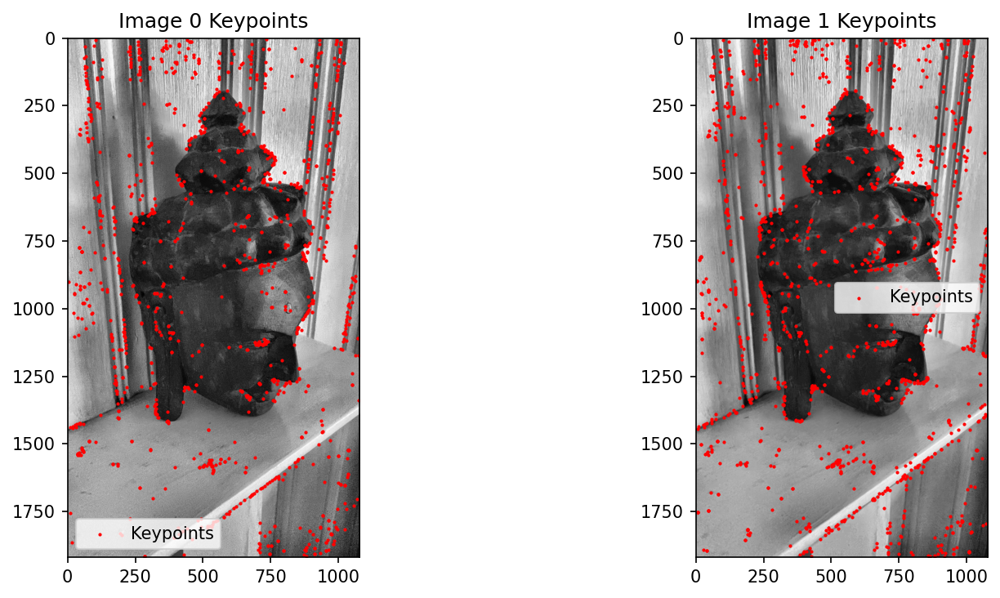
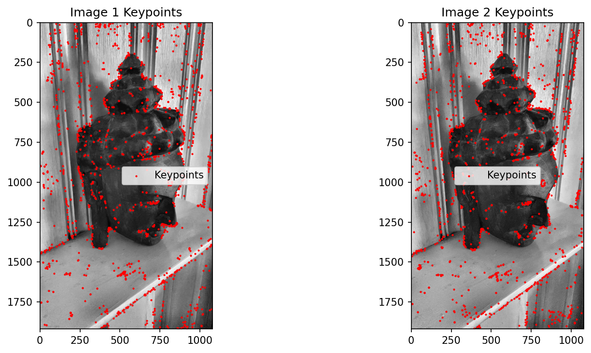
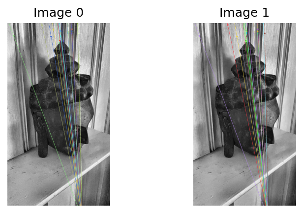
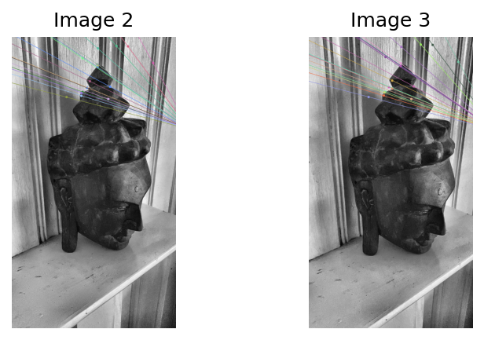
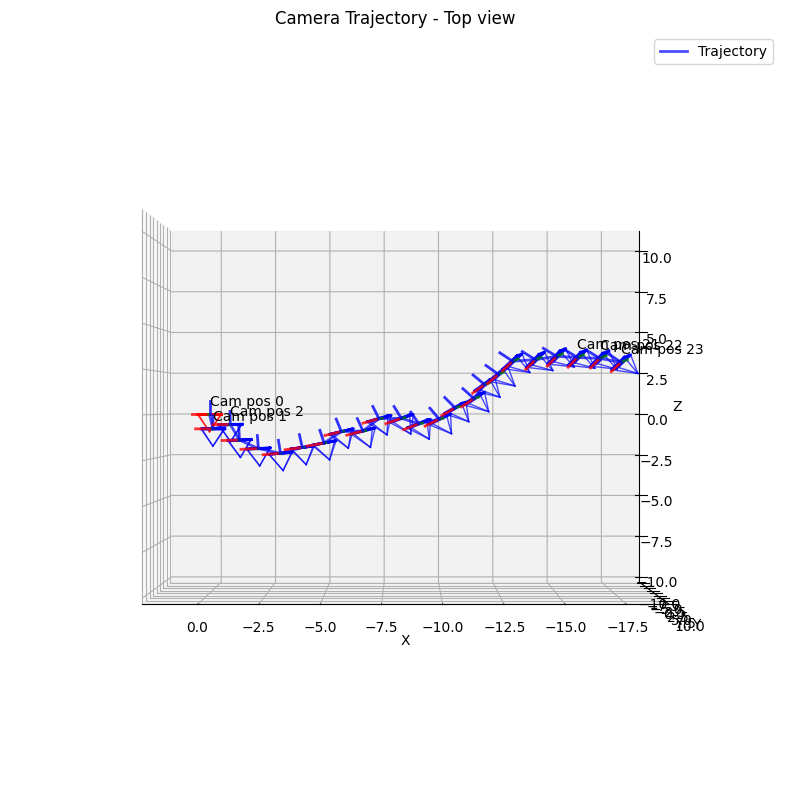

# Structure from Motion (SfM) Pipeline

A full incremental SfM pipeline built from scratch using OpenCV and GTSAM. Takes a sequence of images, reconstructs 3D structure, estimates camera poses, and refines everything with bundle adjustment.

---

## Pipeline Overview

```
Images → Normalization → Feature Detection → Matching → 
Fundamental Matrix → Essential Matrix → Incremental PnP → Bundle Adjustment → 3D Reconstruction
```

---

## Results

### Feature Detection
SIFT keypoints with grid-based non-max suppression for even spatial distribution across the image.

| Image 1 Keypoints | Image 2 Keypoints |
|---|---|
|  |  |

---

### Epipolar Lines
Epipolar geometry validated across image pairs. Lines converge correctly at the epipole, confirming accurate fundamental matrix estimation.

| Pair 0→1 | Pair 2→3 |
|---|---|
|  |  |

---

### Camera Trajectory
Estimated camera poses before and after bundle adjustment.



---

### 3D Reconstruction
Interactive Plotly visualization of triangulated 3D points and camera trajectory.

| Before Bundle Adjustment | After Bundle Adjustment |
|---|---|
|  |  |

---

## How It Works

### 1. Image Preprocessing
Images are normalized using CLAHE for local contrast enhancement followed by z-score normalization for scale invariance.

### 2. Feature Detection and Matching
- **SIFT** descriptor with 4000 keypoints per image
- **Grid-based non-max suppression** (8x8 grid, 25 keypoints/cell) for even spatial distribution
- **Brute-force matching** with Lowe's ratio test at threshold 0.65

### 3. Fundamental Matrix (Custom RANSAC)
8-point algorithm with Hartley normalization inside a RANSAC loop (1000 iterations). Rank-2 constraint enforced via SVD. Inliers selected using symmetric epipolar distance.

### 4. Essential Matrix and Pose Recovery
Essential matrix computed from `E = K^T F K`, corrected to enforce equal singular values. Four pose hypotheses tested and best selected via cheirality check (points in front of both cameras).

### 5. Incremental SfM with PnP
Reconstruction initialized from camera pair (14, 15) which has the best motion baseline. Remaining cameras added incrementally using PnP RANSAC. New 3D points triangulated after each camera addition using DLT.

### 6. Bundle Adjustment (GTSAM)
Full bundle adjustment using GTSAM's Levenberg-Marquardt optimizer. Adaptive noise model based on number of observations per point (1.0px for 4+ observations, up to 2.0px for 2 observations).

```
Initial reprojection error:  ~X.XX pixels
Final reprojection error:    ~X.XX pixels
```

---

## Requirements

```bash
pip install opencv-python numpy gtsam plotly matplotlib
```

You will also need COLMAP output (`cameras.txt`) in:
```
colmap_project/sparse/0/cameras.txt
```

---

## Usage

Place your images in an `images/` folder, then run the notebook top to bottom.

```bash
jupyter notebook sfm_pipeline.ipynb
```

Output folders generated automatically:
- `features_and_roi_output_images/` — keypoint visualizations
- `epipolar_lines_output_images/` — epipolar geometry plots  
- `camera_poses_output/` — camera trajectory plots

---

## Project Structure

```
├── images/                          # Input image sequence
├── colmap_project/sparse/0/         # COLMAP camera intrinsics
├── features_and_roi_output_images/  # Feature detection outputs
├── epipolar_lines_output_images/    # Epipolar line outputs
├── camera_poses_output/             # Camera pose outputs
└── sfm_pipeline.ipynb               # Main notebook
```